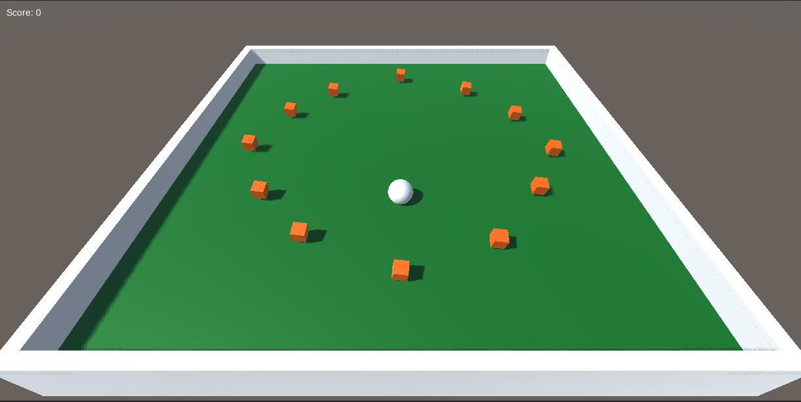

# Roll a Ball Game
by robotoART

### Objective of this sample web game application
To demo and learn how to use Unity3D to create a simple single player skills challenge game. Following Unity3D's tutorial quickly take grasp of basic modeling, C# scripting, and physics concepts.

**Unity's tutorial project** :  [Introduction to Roll-a-Ball](https://unity3d.com/learn/tutorials/projects/roll-ball-tutorial/introduction-roll-ball?playlist=17141)

# Requirements to Run Application
### Unity3D v. 2017.1.1f1
See [Unity's website](https://unity3d.com/unity) for more information.

### Download or Clone this project
**Download** :  Simply go to this repository, https://github.com/robotoART/Roll-a-Ball-Game, click on the green download button at top of page.

**Clone** :  Using the terminal, change directory to wherever you want the project to reside.

From the terminal, run:

    git clone https://github.com/robotoART/Roll-a-Ball-Game

This will give you a directory named **Roll-a-Ball** with all of the necessary components to run and customize the project.

### A Local Web Server (Optional)
This is required if you want to see the game run in a web browser. There are many ways to do this, but the simplest for me has been to run Python's command for a simple server. For a quick guide on how to use Python as a local web server follow [this guide](https://developer.mozilla.org/en-US/docs/Learn/Common_questions/set_up_a_local_testing_server). You will need either Python 2.7 or 3 and above.

## Running the Game App
Once all the requirements listed above are installed and you have downloaded or cloned a copy of the App, simply run in a compatible version of Unity or through a web browser with a local web server of your choice.

Thanks for looking.
